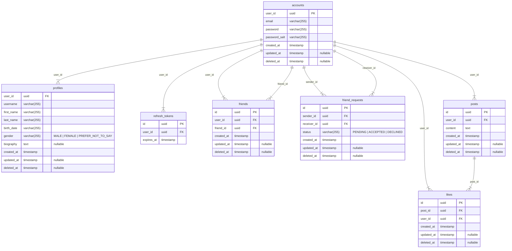

# Database Structure

This is a chart showing the current database structure and which relationships there are between the tables

```mermaid
erDiagram
  accounts {
    user_id uuid PK
    email varchar(255)
    password varchar(255)
    password_salt varchar(255)
    created_at timestamp
    updated_at timestamp "nullable"
    deleted_at timestamp "nullable"
  }

  profiles {
    user_id uuid FK
    username varchar(255)
    first_name varchar(255)
    last_name varchar(255)
    birth_date varchar(255)
    gender varchar(255) "MALE | FEMALE | PREFER_NOT_TO_SAY"
    biography text "nullable"
    created_at timestamp
    updated_at timestamp "nullable"
    deleted_at timestamp "nullable"
  }
  accounts ||--|{ profiles : user_id

  refresh_tokens {
    id uuid PK
    user_id uuid FK
    expires_at timestamp
  }
  accounts ||--|{ refresh_tokens : user_id

  friends {
    id uuid PK
    user_id uuid FK
    friend_id uuid FK
    created_at timestamp
    updated_at timestamp "nullable"
    deleted_at timestamp "nullable"
  }
  accounts ||--|{ friends : user_id
  accounts ||--|{ friends : friend_id

  friend_requests {
    id uuid PK
    sender_id uuid FK
    receiver_id uuid FK
    status varchar(255) "PENDING | ACCEPTED | DECLINED"
    created_at timestamp
    updated_at timestamp "nullable"
    deleted_at timestamp "nullable"
  }
  accounts ||--|{ friend_requests : sender_id
  accounts ||--|{ friend_requests : receiver_id

  posts {
    id uuid PK
    user_id uuid FK
    content text
    created_at timestamp
    updated_at timestamp "nullable"
    deleted_at timestamp "nullable"
  }
  accounts ||--|{ posts : user_id

  likes {
    id uuid PK
    post_id uuid FK
    user_id uuid FK
    created_at timestamp
    updated_at timestamp "nullable"
    deleted_at timestamp "nullable"
  }
  accounts ||--|{ likes : user_id
  posts ||--|{ likes : post_id
```
